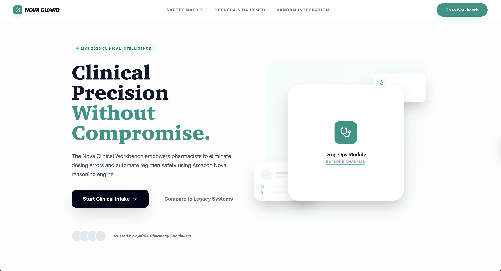
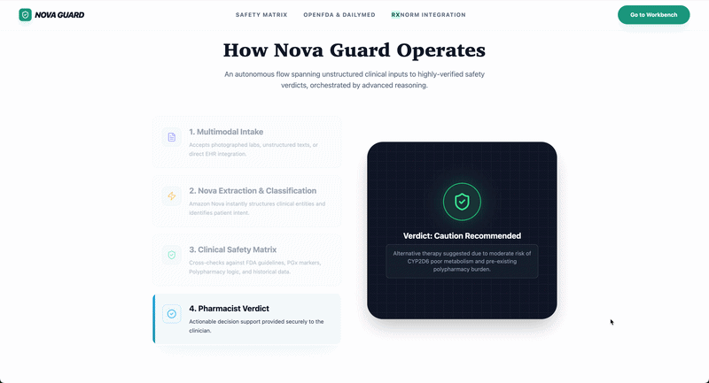
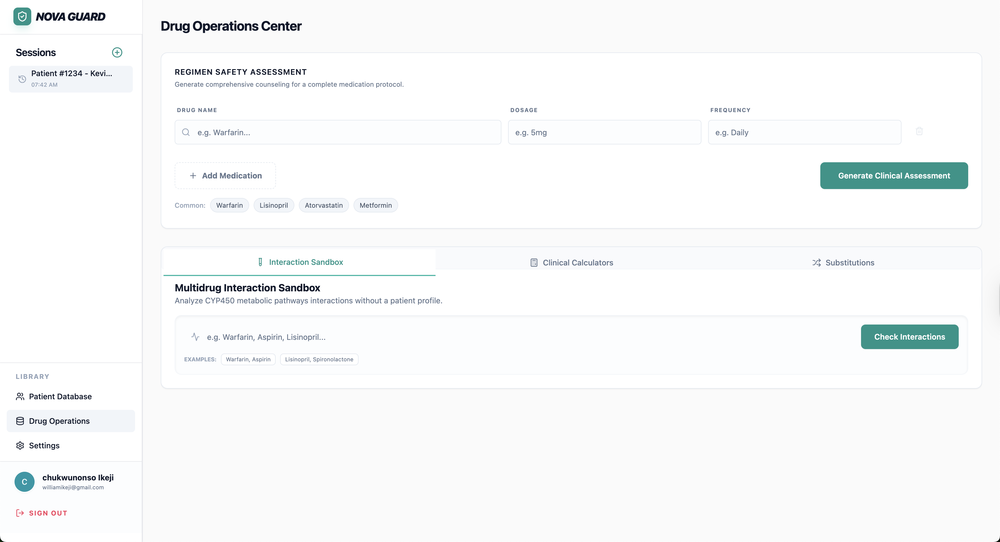
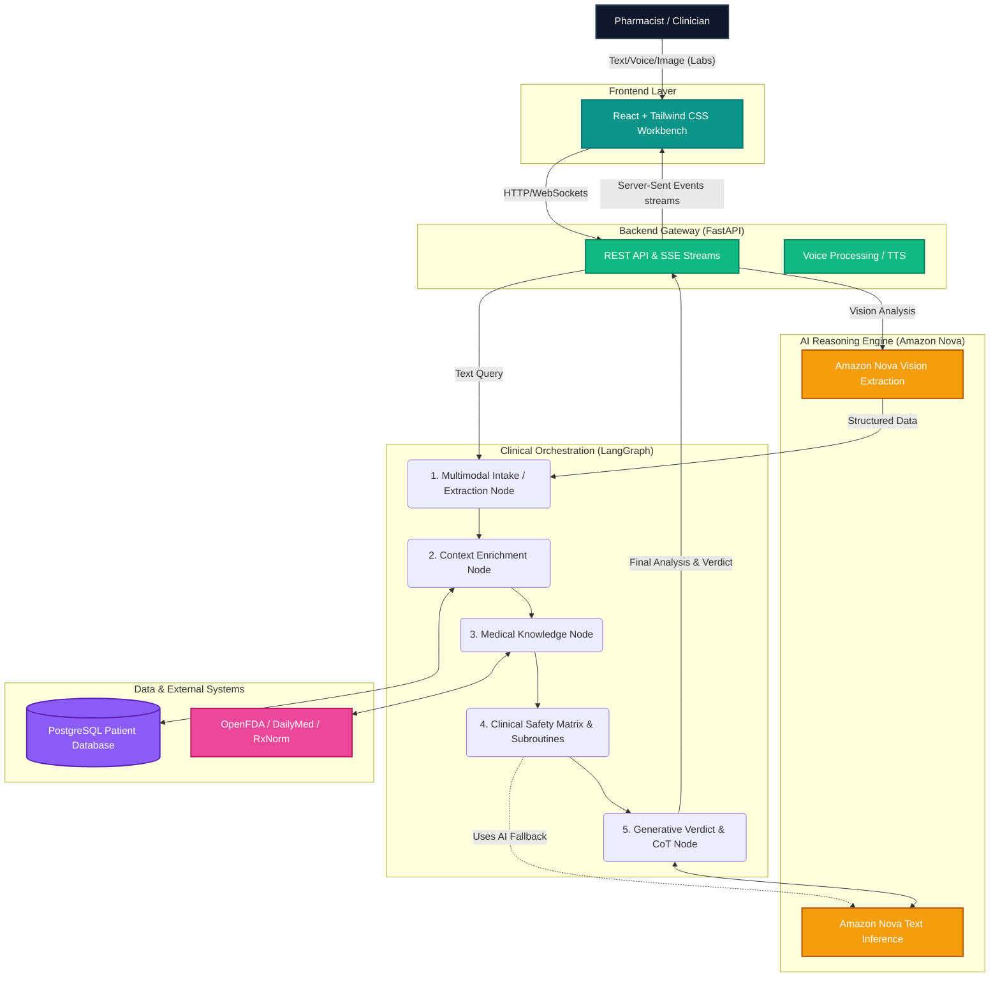
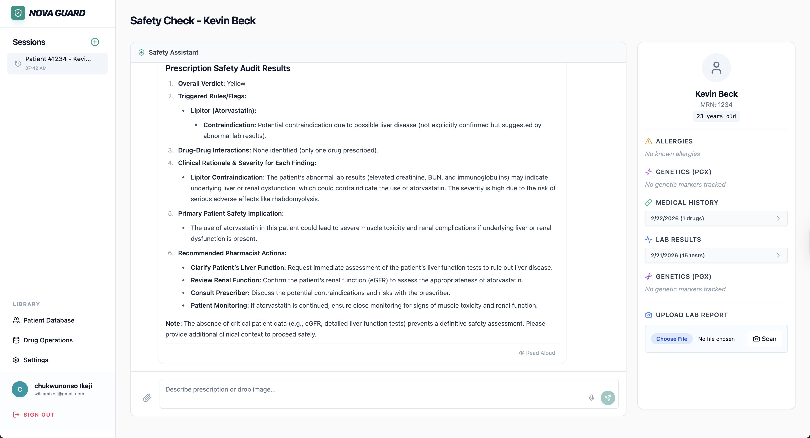

# Nova Guard: Clinical Intelligence Engine



**Nova Guard** is a highly advanced, multi-modal clinical intelligence workbench designed specifically for pharmacists and clinical practitioners. Built natively on **Amazon Nova**, it seamlessly orchestrates clinical safety checks, precision dosing math, and complex patient histories to deliver actionable, transparent decision support.

Our mission is to eliminate cognitive overload and medication errors through intelligent automation—bringing live 2026 clinical intelligence to the pharmacy counter.



##  Core Capabilities

- **Intelligent Intake & Classification (Amazon Nova)**
  - Multimodal input: Type freely, speak directly using your microphone (Nova Voice), or snap/upload a picture of a lab report (Nova Vision). 
  - The system automatically classifies the intent (e.g., Clinical Query, New Prescription) and extracts structured data from chaotic inputs.

- **Pharmacogenomics (PGx) Safety**
  - Live cross-referencing of new prescriptions against a patient's CYP450 genetic markers.
  - Automatically flags critical risks (e.g., prescribing Codeine to a CYP2D6 Poor Metabolizer) and suggests safer alternatives before dispensing.

- **Longitudinal "Time Travel" Audit**
  - Legacy systems only check *current* active medications. Nova Guard travels through the patient's entire profile to detect hidden cross-reactivities.
  - Example: If a patient had a severe allergy to Lisinopril two years ago, the system will actively block a new prescription for Ramipril today due to class cross-reactivity.

- **Polypharmacy Risk Engine**
  - Quantifies anticholinergic and sedative burdens across the entire patient regimen.
  - Generates high-visibility alerts when total active medications exceed safety thresholds, preventing dangerous cascade prescribing.

- **Drug Operations Sandbox**
  - A dedicated clinical calculator suite featuring rigorous Renal Dose Adjustment Math (Cockcroft-Gault, IBW/AdjBW logic).
  - Deep-dive Interaction Matrices and Therapeutic Substitution mapping.



---

##  System Architecture & Workflow

Nova Guard employs a sophisticated agentic workflow powered by **LangGraph** on the backend and an ultra-reactive **React/Tailwind** UI.



### 1. The Gateway (FastAPI & Multimodal Adapters)
Inputs arrive via text, audio blobs, or images. The backend instantly routes these to specific Amazon Nova inference endpoints. Voice is transcribed, and images of lab results (like CMP panels showing eGFR or AST/ALT) are structured into JSON using Nova Vision.

### 2. The Orchestrator (LangGraph)
A stateful, multi-agent graph handles the core intelligence:
1. **Extraction Node:** Amazon Nova structures the raw input into `PatientState` objects (Drug Name, Dose, Frequency).
2. **Context Enrichment:** The `fetch_patient_node` pulls the unified patient profile (genetics, history, labs, active meds) from PostgreSQL.
3. **Medical Knowledge Node:** Reaches out to the NIH **RxNorm API** to retrieve exact `RxCUI` identifiers, then queries the **OpenFDA API** and **DailyMed** for box warnings, recalls, and pharmacokinetics.
4. **Clinical Safety Matrix:** Executes the deterministic safety checks (PGx, Polypharmacy, Beers Criteria, Pregnancy flags).
5. **Generative Verdict:** The `assistant_node` analyzes the context and the safety flags, using Amazon Nova (Reasoning mode) to output a chain-of-thought `<clinical_analysis>` and a final, actionable verdict.

### 3. The Frontend (React + Server-Sent Events)
The UI subscribes to real-time event streams (SSE). As the LangGraph nodes execute, the UI dynamically updates with glowing indicators, badges, and the streaming Chain-of-Thought analysis, ensuring the pharmacist has total visibility into the AI's "thought process."



---

##  Features List

Our core capabilities are divided into five distinct domains:

1. **Multimodal Clinical Chat**: 💬 Speak, type, or upload images directly to the bot.
2. **Amazon Nova Vision Lab Parsing**: 📷 Automatically extracts eGFR, AST/ALT, and platelets directly from printed lab report photos.
3. **HIPAA Auto-Deidentification Node**: 🛡️ Instantly strips Private Health Information (names, identifiers) before sending data to cloud LLMs.
4. **Pharmacogenomics (PGx) Safety Matching**: 🧬 Intercepts dangerous enzyme mismatch events (e.g. CYP2D6 Poor Metabolizer) dynamically.
5. **Longitudinal "Time Travel" Record Alerting**: ⏱️ Analyzes medications a patient stopped months ago to catch class cross-reactivity and hidden allergies.
6. **Polypharmacy Threshold Guardrails**: 💊 Calculates anticholinergic and sedative burden indexes to block potentially fatal cascading interactions.
7. **Clinical Calculator Suite & Math Engine**: 🧮 Standalone tools for Cockcroft-Gault Renal Dosing, Hepatic Impairment Dose Reductions, and Pediatric formulas.
8. **Real-time OpenFDA & DailyMed Scraping**: 📡 Feeds the latest Boxed Warnings, Label Revisions, and Recalls into the reasoning state.

---

## 🔐 HIPAA Compliance Note
Nova Guard features a built-in strict de-identification node. Before any patient data is transmitted to the Amazon Nova LLM for reasoning, all personally identifiable information (PII)—such as names—is stripped and replaced with generic UUIDs (e.g., `Patient-999`). 

---

##  Technology Stack

- **AI Reasoning & Multimodal:** Amazon Nova (Text, Vision)
- **Agent Orchestration:** LangGraph & LangChain
- **Backend:** Python, FastAPI, SQLAlchemy
- **Database:** PostgreSQL (async)
- **Frontend:** React, TypeScript, Tailwind CSS, shadcn/ui, Framer Motion
- **External Clinical Integrations:** OpenFDA, NIH RxNorm, DailyMed

---

##  Getting Started

### Prerequisites
- Python 3.12+ 
- Node.js (via `bun` or `npm`)
- PostgreSQL database
- AWS Account configured with Bedrock access for Amazon Nova models

### Backend Setup
```bash
# Clone the repository
git clone git@github.com:codypharm/NovaGuard.git
cd nova-guard

# Create a virtual environment and sync dependencies using uv
uv sync

# Set up your environment variables
cp .env.example .env
# Edit .env to add your AWS_REGION, AWS_ACCESS_KEY_ID, AWS_SECRET_ACCESS_KEY, and DATABASE_URL

# Run DB Migrations
alembic upgrade head

# Start the FastAPI Server
uv run uvicorn src.nova_guard.main:app --reload --port 8000
```

### Frontend Setup
```bash
cd frontend

# Install dependencies
bun install

# Set up environment variables
cp .env.local.example .env.local
# Edit .env.local with your Clerk publishing keys and VITE_API_URL

# Start the dev server
bun dev
```

Visit `http://localhost:5173` to launch the clinical workbench.
